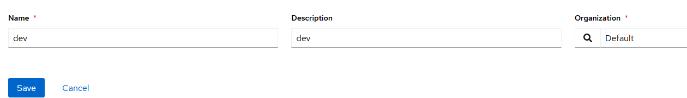
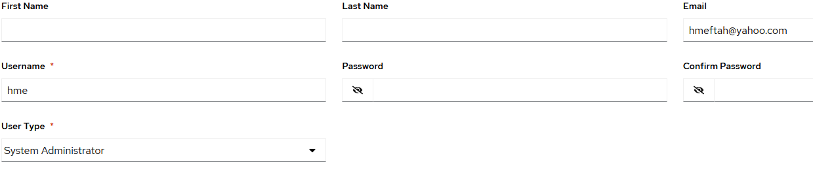
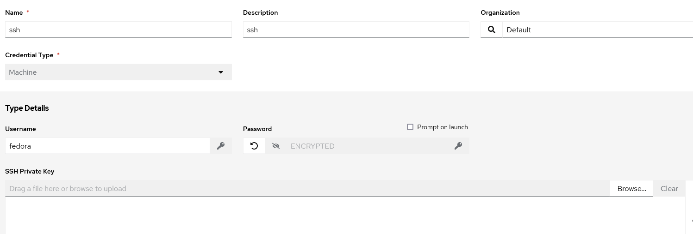
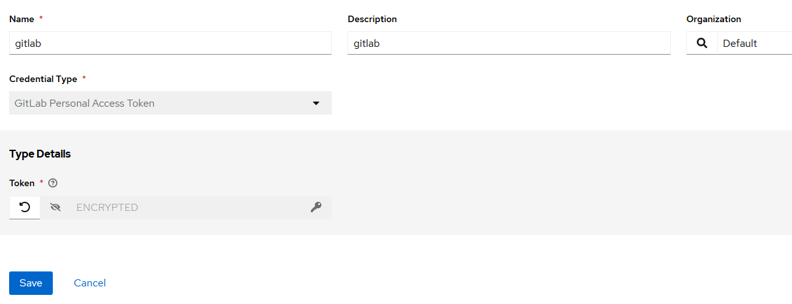
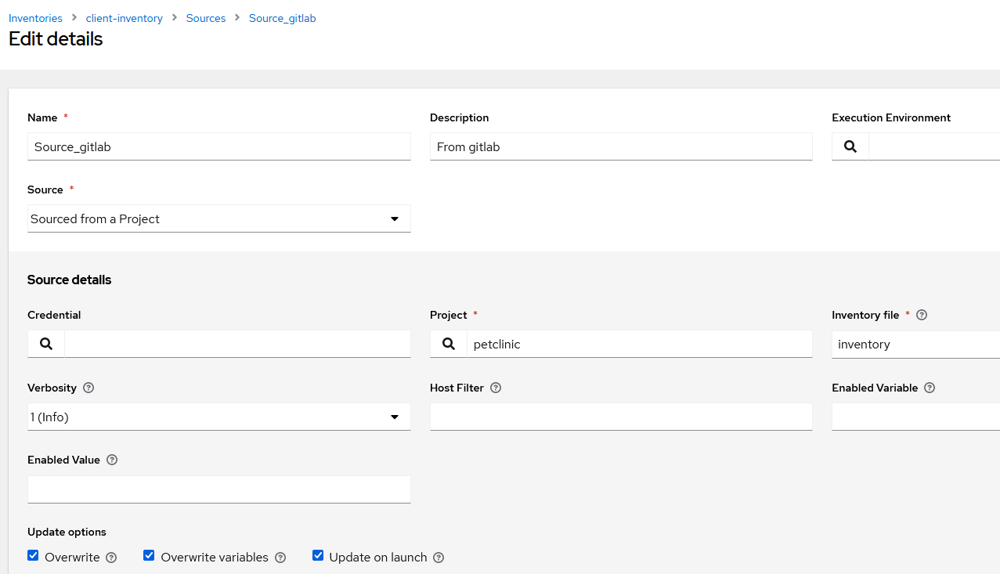
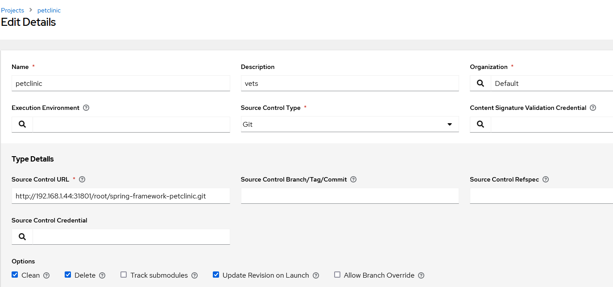
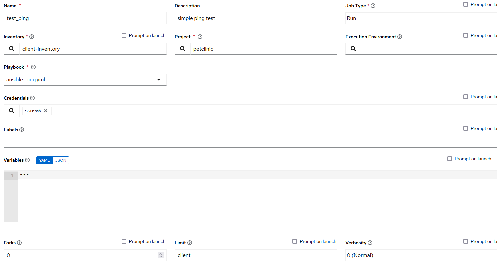

# Differents set up of AWX

## install on kubernetes kind
```shell
wget https://github.com/kubernetes-sigs/kind/releases/download/v0.27.0/kind-linux-amd64
mv kind-linux-amd64 kind
chmod +x kind
sudo mv kind /usr/local/bin/kind
kind version # should be  version 0.27.0
```
## install kubectl
```shell
curl -LO "https://dl.k8s.io/release/$(curl -L -s https://dl.k8s.io/release/stable.txt)/bin/linux/amd64/kubectl"
chmod +x kubectl
sudo mv kubectl /usr/local/bin/kubectl
# add in .bashrc
alias ks='kubectl'
source <(kubectl completion bash | sed s/kubectl/ks/g)
# check 
kubectl version
```

## Create a cluster
```shell
cd /home/ubuntu/jenkins-pic/kind
kind create cluster --name awx --config kind-config-cluster.yml
ks version # should be version  v1.32.2+
ks get nodes # see one controle-plane and 3 workers
```

## install AWX
```shell
cd
git clone https://github.com/ansible/awx-operator.git
cd awx-operator/
git checkout tags/2.19.1
git log --oneline  # HEAD should be on tag 2.19.1 #hash dd37ebd
export VERSION=2.19.1
```

### Manually create file kustomization.yaml
```yaml
apiVersion: kustomize.config.k8s.io/v1beta1
kind: Kustomization
resources:
  # Find the latest tag here: https://github.com/ansible/awx-operator/releases
  - github.com/ansible/awx-operator/config/default?ref=2.19.1
  - awx-demo.yml
# Set the image tags to match the git version from above
images:
  - name: quay.io/ansible/awx-operator
    newTag: 2.19.1

# Specify a custom namespace in which to install AWX
namespace: awx
```
```ks create ns awx```
```ks apply -k . ```  run twice(??) this command

Wait 15 minutes
And check with ```ks get pod -A``` # all K8s objects should be running, completed 

## User AWX
username admin
Password uses the command below
```shell
kubectl get secret -n awx  awx-demo-admin-password -o jsonpath="{.data.password}" | base64 --decode ; echo
```
## Web access
```
kubectl port-forward -n awx service/awx-demo-service 30540:80 --address='0.0.0.0' &
```
access to AWX with http://<ip>:30540


## Troubleshooting to prevent job template failure in AWX
```shell
echo fs.inotify.max_user_watches=655360 | sudo tee -a /etc/sysctl.conf
echo fs.inotify.max_user_instances=1280 | sudo tee -a /etc/sysctl.conf
sudo sysctl -p
```

---

## If you want installing AWX using docker not kubernetes 
```shell    
cd 
git clone -b 24.0.0 https://github.com/ansible/awx.git # check awx tag stable version
source jenkins-pic/venv/bin/activate
cd awx
sudo apt install make ansible
make docker-compose-build
make docker-compose COMPOSE_UP_OPTS=-d
# use shell or portainer
docker exec -it tools_awx_1 awx-manage createsuperuser
docker exec tools_awx_1 make clean-ui ui-devel
```

Go to https://<vm_ip_address>:8043


## Create a Team


## Create a user 


## Create a Credential for ssh 


## Create a Credential for gitlab


## Create a inventory source 


## Create a projet


## Create a template


## Results
Go AWX in spring-framework-petclinic 

---

## Old install of AWX 17.1.0
```shell
cd    # set to your home directory 
git clone https://github.com/ansible/awx.git   # get the awx github repo 
cd awx   # current directory
git checkout 17.1.0  # latest version using docker
git branch  # Check if it is ok
python3 -m venv venv   # python virtualenv
source venv/bin/activate  # set the new environment 
pip3 install wheel   # permission
pip3 install requests  # internal 
pip3 install docker==6.1.3   # docker python lib
pip3 install docker-compose # docker script
pip3 install ansible  # provisioning tool
cd installer #  
# create a file vars.yml and copy and paste these 3 following lines
admin_password: 'adminpass'
pg_password: 'pgpass'
secret_key: 'mysupersecret'
# hit the command
ansible-playbook -i inventory install.yml -e @vars.yml

```