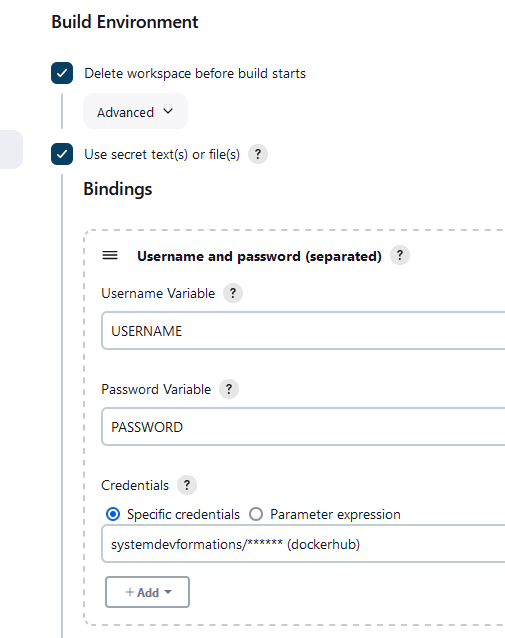

# Deployment using Docker 
Using Docker , the deployment stage is done by a Dockerfile inside the  
git repo itself. This is the part of Devops where the infrastructure is in a code.(IaC)  

## Create a Docker build job and upload image to docker hub
Create a job petclinic_docker_build    
Go to New Item -> Enter a name -> Freestyle -> ok        
Source code management    
Check git, provides the git repo of petclinic 
Go to build environment
Tick delete workspace before build starts
Select user password separated 
As follow 



Go to Build paragraph   
Select Execute shell and copy/paste the following script     
In this script, the Nexus war file is injected in a Docker image of Tomcat   server    
```shell script
wget http://nexus:8081/repository/maven-releases/org/springframework/samples/spring-framework-petclinic/1.0/spring-framework-petclinic-1.0.war -O ${WORKSPACE}/petclinic.war
docker build -t petclinic:latest .
docker login -u $USERNAME -p $PASSWORD
docker image tag petclinic $USERNAME/petclinic
docker push $USERNAME/petclinic
```
Build
And apply and save

### Toubleshooting 
Add sudo package 
Add jenkins user in visudo 

Now we have a complete infrastructure for running our code.


## Run  Docker container as a testing environment 
Create a job petclinic_docker_run  
Go to New Item -> Enter a name -> Freestyle -> ok    
Source code management  
You don't need to tick git as the source code is inside the docker image  
Build  
Select Execute shell and copy/paste the following code  
```shell script
CONTAINER_NAME="web"
OLD="$(docker ps --all --quiet --filter=name="$CONTAINER_NAME")"
if [ -n "$OLD" ]; then
  docker rm -f $OLD
fi
docker run -d --name web -e  ALLOW_EMPTY_PASSWORD=yes -p 30190:8080 petclinic
```
and Build now 

Hit a new tab in your browser and check   
```http://<ip_address_your_vm>:30190/petclinic```

### Troubelshooting 
Add environment variable for tomcat-9 bitnami container , see docker logs file


## Got to file NEXUS_DOCKER_REGISTRY.md
