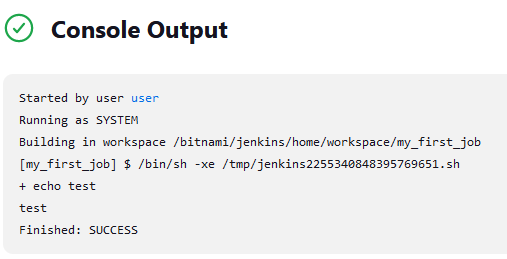
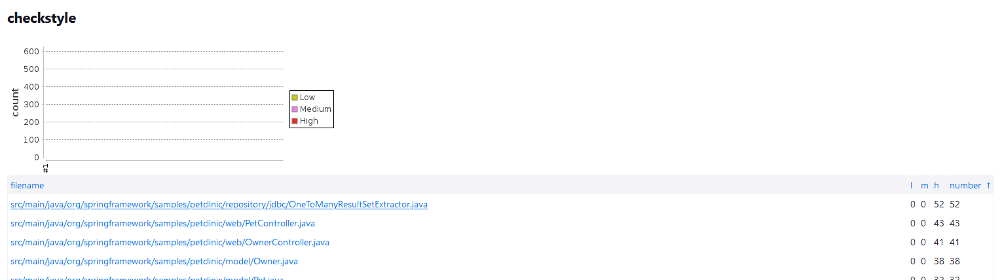
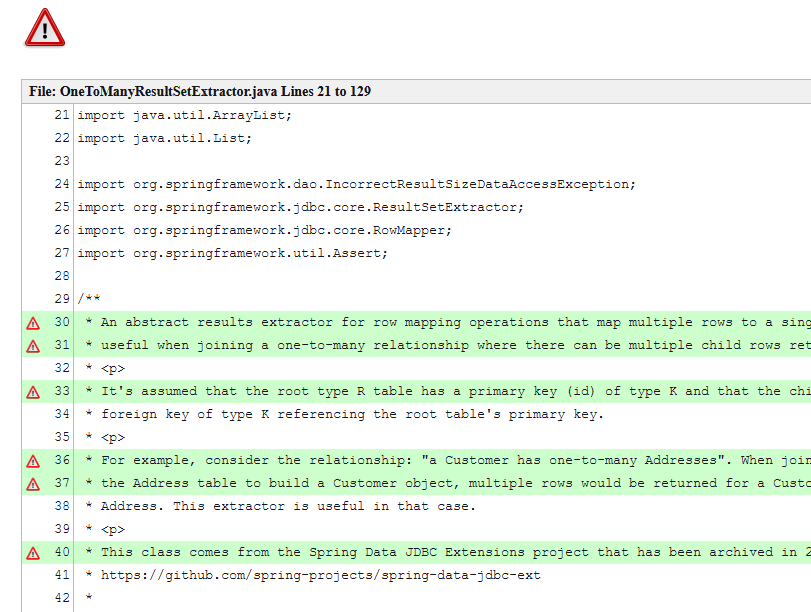
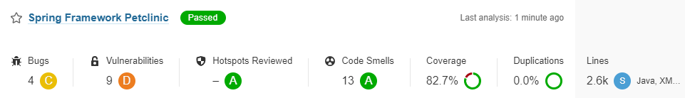
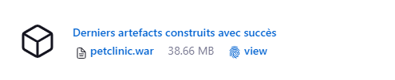
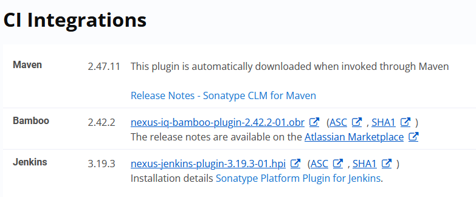
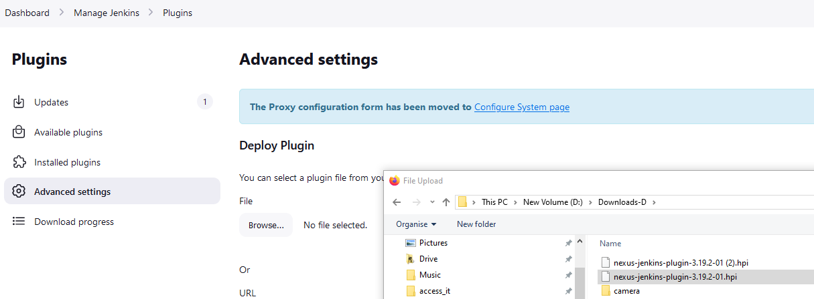
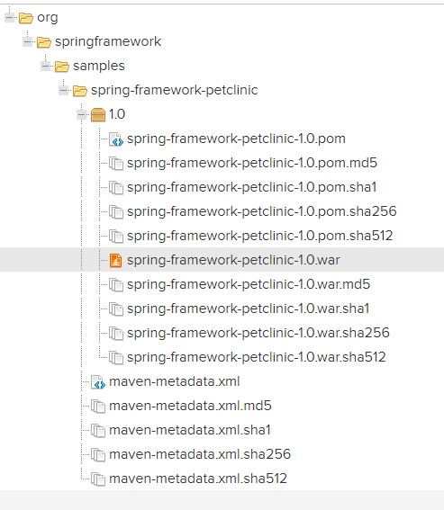

# First Jobs
We are going to set up our first Jenkins jobs    

## Echo "Test" 
Go to jenkins dashboard, select New Item 
Type a name my_first_job, hit freestyle and OK      
select build Execute a shell   
type ```echo "test"```  
and press  apply and save   
Press Build Now  
See the result by pressing the build #1  
and go to console output  




## Install github plugin and maven plugin   
manage jenkins -> plugin manager   
select available plugins  
search for **GitHub**, tick github      
filter maven type enter and tick **Maven Integration**       
and hit install, don't select restart Jenkins  
hit Dashboard  

go to Manage Jenkins -> tools  
Scroll down to **Maven installations**
Hit Add Maven    
Name: Maven 3.6.3  
install automatically from Apache select version 3.6.3  
Hit  save

## Petclinic using Maven 
New Item -> Name petclinic-maven, select  maven project and ok   
select git as a source code management  
Replace the git repo with your repo spring-framework-petclinic
```
  https://github.com/<your_github_project/spring-framework-petclinic.git 
```
Copy and paste your own repo    
Build Root POM: pom.xml file     
Goals are: clean install package   
Hit save   
and press Build now 
Find the console ouput page 
Check Jenkins workspace, in target directory this is petclinic.war file

## Petclinic CheckStyle 
manage jenkins -> plugin manager   
select available plugins  
search for **Violations**, tick it   
Hit install, don't select restart Jenkins    
New Item -> Name petclinic-checkstyle, copy from petclinic-maven  
In Build  
change Goals to: **clean checkstyle:checkstyle install package**  
In Build Settings  
**Tick violations**    
Hit Build now  
On a left menu select **Violations**   
Select the link **Spring Framework Petclinic**   
Hit the graph for displaying all issues found by CheckStyles      

**Summary**

**Details**


## Petclinic Q/A with Sonar 
manage jenkins -> manage plugins  tab Available     
Search in available plugins  the **Sonarqube Scanner** plugin  
and hit install
Go to manage Manage jenkins -> System
Sonarqube server   
Tick enable Environnment variables  ....
Press the button add sonarQube
enter Name: SonarQube  
enter ServerURL: http://sonar:9000    
Type this URL without leading whitespaces  
click on  add , select jenkins   
you are going to create a new credential for sonar     
in the credential screen select kind as a secret text   
Open an other browser tab, go to  
Type ```http://<your_ip_address:32520>``` in your browser    
click on login in left-up side of the screen    
Login using user: admin  password : bitnami  
Go to administration, security , users, click on the icon on the right token  
Type a name jks and press generate     
Back to the Jenkins screen, copy the token in the credential as a secret text in jenkins     
Set an ID text as SonarToken for this credential    
and a description SonarToken     
Hit Add  
In the server authentication token select SonarToken 
Press save 

Hit New Item,  enter a name petclinc-sonar  
copy from petclinic-maven  
hit ok  
in **Build Environment**
Tick in 'Prepare SonarQube Scanner environment'**      
Change Goals as ``` clean package sonar:sonar -Dsonar.host_url=$SONAR_HOST_URL```      
Press apply and save
Hit Build Now  

### How to check the code quality with Sonar
Type ```http://<your_ip_address:32520>``` in your browser  
Login using user: admin  password : bitnami  
See the result by selecting Projects
  
 

## Deploy your war file to Nexus repository
### Configuring Nexus
Open a browser tab :  
http://<your-ip_address:32510/  
get nexus token access  
Go to portainer, open a console on the container jenkins-pic_nexus_1  
type ``` echo " " | cat /nexus-data/admin.password  - ```  
Copy and the password/token in nexus  
Set a news password for the user admin  
Tick enable anonymous access      
Go to the wheel icon in the top menu , select repositories     
Select maven-releases   
go to Hosted paragraph   
Set Allow redeploy  # allow the same version to be redeployed , should not being set on production environment !!!
Press Save 

## Get an artifact 
Go to your first petclinic-maven   
select configure     
and press post build actions    
select archive the artifacts, in the text-edit files to archive type ```**/*.war```
Press apply and save      
Build this job again


 
Go to manage jenkins -> Plugin Manager  
Search in available plugins the **Copy artifact** and   
 and **Workspace Cleanup** plugins  
Tick both them  and install it, without restarting Jenkins  
Go to https://help.sonatype.com/en/download-and-compatibility.html



download
https://download.sonatype.com/integrations/jenkins/nexus-jenkins-plugin-3.19.2-01.hpi  
Go to manage jenkins -> Plugin Manager     
Select Advanced Setting, select browse... select the downloaded hpi file  



Hit deploy  

Go to manage jenkins -> System    
find Sonatype Nexus paragraph , hit add nexus repo ...   
Select 3.x Server     
Display Name :  Nexus    
Server ID :  Nexus    
Server URL: http://nexus:8081    
Create a credentials user/password  admin/xxxxx ID: nexuslogin  Description: nexuslogin     
Press Add    
select the credentials in Sonatype Nexus configuration    
Check with a Test Connection    
and then click Apply and Save  

Create a job, petclinic_nexus, and choose freestyle project, click ok  
Go to Build, select copy artifacts from petclinic-maven    
Set artifacts to copy to ```**/*.war ```  
Tick in Build Environment **Delete workspace before build starts**  
Add another build step , **Nexus Repository Manage Publisher**      
Nexus instances:  Nexus  
Nexus Repo: maven-release   
add Package maven   
Group and artifact are coming from your project pom.xml  
Here is :  
Group: org.springframework.samples  
artifact: spring-framework-petclinic  
Version: 1.0
Packaging: war  
Add artifact Path:  
File Path: target/petclinic.war 
Apply and Save  
Build Now  

### Find the saved artifact in Nexus
And check in Nexus http://<your_ip>:32510/  
Login admin and password xxxxx 
Select in the left  Repositories, click on release and browser down to find your war file



## Go to the file JETBRAINS.md


