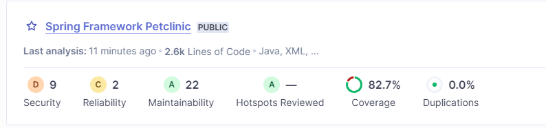

# First Jobs
We are going to set up our first jobs    

## echo "Test" 
Go to jenkins, select New Items  
Type a name my_first_job, hit freestyle and OK      
select build Execute a shell   
type ```echo "test"```  
and press  apply and save   
Press Build Now  
See the result by pressing the build #1  
and go to console output  

## install github plugin and maven plugin   
manage jenkins -> plugin manager -> tab available     
filter github type enter and tick github integration  
filter maven type entrer and tick maven integration     
and hit install without restart  

go to manage jenkins -> global tool configuration 
Maven -> add maven    
Name Maven 3.6.3  
install automatically from Apache select version 3.6.3  
Hit apply and save

## Hello world using Maven 
New Item -> Name Hello-world-maven, select  maven project and ok   
select git as a source code management   
in your github tab fork and clone that https://github.com/crunchy-devops/hello-world.git
Copy and paste your own repo hello-world    
Build uses a: pom.xml file     
Goals are: clean install package   
Hit apply and save   
and press Build now 

## Hello world Q/A with Sonar 
manage jenkins -> manage plugins  tab Available     
filter sonar and select Sonarqube Scanner  
and install without restart  
Go to manage Manage jenkins -> Configuration system
Sonarqube server   
Tick enable injection  ....
Press the button add sonarQube
Name: SonarQube  
ServerURL: http://sonar:9000    
Type this URL without leading whitespaces  
click on  add , select jenkins   
you are going to create a new credential for sonar     
in the credential screen select kind as a secret text   
Open an other browser tab, go to  
Type ```http://<your_ip_address:19000>``` in your browser    
click on login in left-up side of the screen    
Login using user: admin  password : admin  
Go to administration, security , user, click on the icon on the right token  
Type a name jks and press generate     
Back to the Jenkins screen, copy the token in the credential as a secret text in jenkins     
Set an ID text as SonarToken for this credential    
and a description SonarToken     
Hit Add  
In the server authentication token select SonarToken 
Press apply and save 

Hit New Item,  enter a name hello-world-sonar  
copy from  My_first_maven_build  
hit ok  
Tick in **build environment 'Prepare SonarQube Scanner ...'**      
Change Goals as ``` clean package sonar:sonar -Dsonar.host_url=$SONAR_HOST_URL```      
Press apply and save
Hit Build Now  

### How to check the code quality with Sonar
Type ```http://<your_ip_address:19000>``` in your browser  
Login using user: admin  password : admin  
See the result by selecting Projects
  
 
 

## Deploy your war file to repository Nexus
### Configure Nexus
Open a browser tab :  
http://<your-ip_address:18081/  
get nexus token access     
```shell script
docker exec -i jenkins-pic_nexus_1 cat /nexus-data/admin.password
```  
Set your password for nexus  
Tick enable anonymous access    
Go to the wheel in the menu , select repositories   
Select maven-releases   
go to Hosted   
Set Allow redeploy  # allow the same version to be redeployed 
Press Save 

## Create your Job
Go to your first hello-world-maven   
select configure     
and press post build actions    
select archive the artifacts, in the text-edit files to archive type ```**/*.war```
Press apply and save      
Build now this job again  

 
Go to manage jenkins -> Plugin Manager -> Tab available  
Filter copy artifact, check and  
Filter Nexus, select Nexus Platform,  tick the checkbox        
install without restart  
Go to manage jenkins ->configuration system  
find Sonatype Nexus  
Select 3.x Server   
Display Name :  Nexus  
Server ID :  Nexus  
Server URL: http://nexus:8081  
Create a credentials user/password  admin/xxxxx ID: nexuslogin   
Press Add    
select the credentials in Sonatype Nexus configuration    
Check with a Test Connection    
and then click Apply and Save  
Create a job, hello_world_nexus, and choose freestyle project, click ok  
Go to Build, select copy artifacts from another project    
Set artifacts to copy to ```**/*.war ```  
add an another build, Nexus Repository Manage Publisher      
Nexus instances:  Nexus  
Nexus Repo: maven-release   
add Package maven   
Group and artifact are coming from your project pom.xml  
Here is :  
Group: com.example.maven-project
Artifact: maven-project
Version: 1.1  
Packaging: war  
Add artifact Path:  
File Path:  webapp/target/webapp.war  
Apply and Save  
Build Now  

### Find the saved artifact
And check in Nexus http://<your_ip>:18081/  
Login admin and xxxxx 
Select in the left  Repositories, click on release and browser down to find your war file


