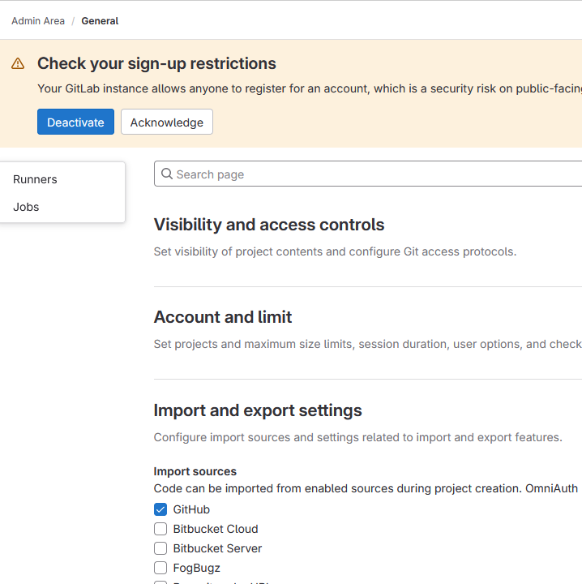

# Add a Gitlab container in Jenkins-PIC

## Change docker-compose  
```yaml
services:
  gitlab:
    hostname: gitlab
    image: gitlab/gitlab-ce:latest
    ports:
      - "443:443"
      - "32701:80"
      - "32222:22"
    networks:
      - prodnetwork
    environment:
      - GITLAB_OMNIBUS_CONFIG="gitlab_rails['gitlab_shell_ssh_port'] = 32222"
    volumes:
      - /opt/gitlab/config:/etc/gitlab
      - /opt/gitlab/logs:/var/log/gitlab
      - /opt/gitlab/data:/var/opt/gitlab
```
In jenkins service add 
```yaml
    depends_on:
      - nexus
      - sonar
      - jmeter
      - gitlab   # add
```
## Restart all services 
```shell
   cd
   cd jenkins-pic 
   source venv/bin/activate
   docker-compose start  
  ```
## Sanity Tests
On portainer check all containers  
You should see the container named **jenkins-pic_gitlab_1**    
Check the log  

## Log in 

Get portainer tool up and running  
go to container gitlab-course_gitlab-ce_1 and select the **exec_console** icon           
Type ``` echo " " | cat  /etc/gitlab/initial_root_password -```  
Log in to http://your_ip_address:31801   
User root user and copy/paste the password  

## Password Troubleshooting
if you have some trouble reset password ```sudo gitlab-rake "gitlab:password:reset"```          
Log in as root using this password   

## Add Github project in GitLab   
Do as define below   
Go to admin area -> General
In **Import and export settings**, tick github  

 

Go to Your Work -> Projects -> New project    
Select **Import Project**  Hit Github     
Enter your Personal Access Token   
Hit Authenticate  
Select spring-framework-petclinic  
Now your project is located in your jenkins-pic platform with no access from the outside
world  

## 


