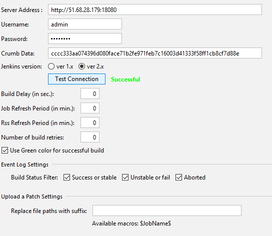
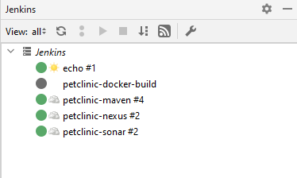

# Configure your IDE 
Set up your workspace environnement using JetBrains      
You should use Goland Jetbrains   

Download the package from   
https://www.jetbrains.com/idea/download/download-thanks.html?platform=windows

## In the IDE 
Go to File -> Settings  -> Plugins 
and install Jenkins Control Plugin 
Restart IntellijIDEA
You got a right-hand side tab named Jenkins   
Click on the wrench to get the configuration dialog window
Fill Server Address, username, passwords, crumb data , jenkins version ver 2.x
Tick use green color....

### API token  
go to 
Copy in crumb data the API token previously saved in your notepad. 

## Remove CSRF failed check 
Go to Manage Jenkins -> Script console and run the following groovy script.
```groovy
import jenkins.model.Jenkins
def instance = Jenkins.instance
instance.setCrumbIssuer(null)
```
Result  


