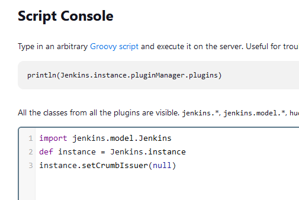

# Configure your IDE 
Set up your workspace environnement using JetBrains      
You should use Goland Jetbrains   

Download the package from   
https://www.jetbrains.com/go/download/download-thanks.html

## In the Jetbrains IDE 
Go to File -> Settings  -> Plugins   
and install **Jenkins Control Plugin**   
Restart Goland   
You got a right-hand side vertical bar tab named Jenkins     
Select the flat key of 15 in the menu bar   
Select Jenkins Server Settings...   
Fill in  Server Address is  http://<ip>:32500/ , username, Token or password,
token was previously saved in your notepad  
Hit Test connection 

## Eventually troubleshooting CSRF malformed
Go to Manage Jenkins -> **Script console** and run the following groovy script.



```groovy
import jenkins.model.Jenkins
def instance = Jenkins.instance
instance.setCrumbIssuer(null)
```

## Eventually Troubleshooting   
if you have a message URL is malformed   
Go to Jenkins -> manage Jenkins-> System  
Go to Jenkins Location   
and remove the trailing /   
Press save  
and test again 


## Go to DEPLOYMENT.md file and follow the instructions.