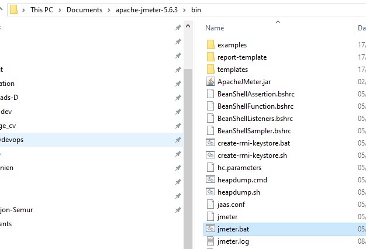
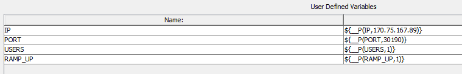
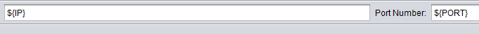
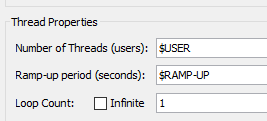
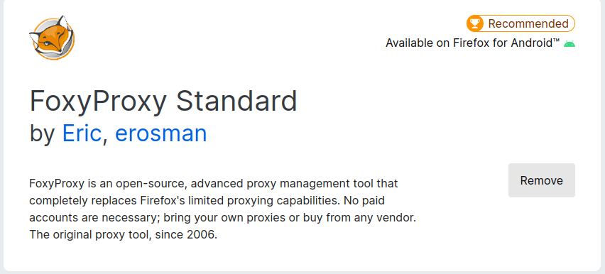
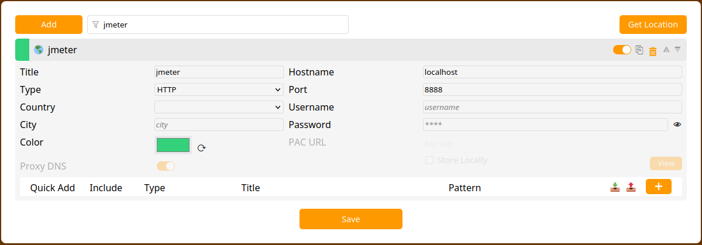
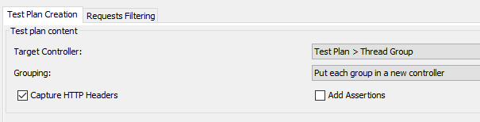
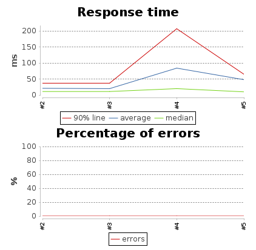

# JMeter tests
Install JMeter on your localhost , for example in Document directory in C: drive  



## Create a test plan for Hello-world website  
Install Jmeter on your localhost, start JMeter and create the following test plan.    

  
Start with your mouse over test plan and right click on it.  
 menu  Add -> Config Element -> **HTTP Request Defaults**  
Start with your mouse over test plan and right click on it.    
 menu  Add -> Thread -> **Thread Group**  
Start with your mouse over Thread group and right click on it.  
menu Add -> Sampler ->  **Http request**  
Start with your mouse over Http request and right click on it.  
menu Add -> Assertions ->  **Response assertion**  
Start with your mouse over Thread Group and right click on it.  
menu Add -> Listener->  **View Results Tree**  

Click on **Response Assertion**  
In Pattern to Test  click Add and enter bonjour  
Click on **HTTP Request**  
In Server Name or **IP: < vm_ip_address>**   
Port Number : **30190** 
Path: **/petclinic**
Click on **View Results Tree**   
Save this file to your project directory
and press the green triangle in the menu bar   

Add the JMeter global variables in the test plan screen    
Click on Add , click on the left part of the line, type IP  
in right part of a line type **${__P(IP,<our_ip>)}**  
Click again on Add, click on the left part of the line, type PORT  
in right part of a line type **${__P(PORT,30190)}**

Click on Add , click on the left part of the line, type USERS
in right part of a line type **${__P(USERS,1)}**  
Click again on Add, click on the left part of the line, type RAMP_UP  
in right part of a line type **${__P(RAMP_UP,1)}**





IN **Http_Request_Defaults** enter respectively **${IP}** and **${PORT}**



In Thread Group  enter **$USER** in **Number of Theads**
enter **$RAMP-UP** in **Ramp-up period**



Remove IP and port in **HTTP Request**    
Clean up your view Results tree screen with the broom in the main menu   
and test again your test plan       
you should see the same result as before.       

Save this test plan in your github repo project, a jmx file is generated    

## Create a Jmeter Jenkins Job
### Add  2 Jenkins plugins
Go to manage-Jenkins -> Manage plugins -> Available Plugins  
Search **Log Parser** and **Performance**   
Tick both of them  
Go to New Item  type petclinic_jmeter   
copy from  petclinic_docker_build  
Remove all code in Build Execute Shell build copy/paste the following script  
```shell script 
jmeter -Jjmeter.save.saveservice.output_format=xml -Jjmeter.save.saveservice.response_data.on_error=true -n -t petclinic_test_plan.jmx  -l testresult.jlt
```
All jmeter default variables are used in this test  


### Add a Post-build actions 
Remove Build another project
Select Console ouptut (build log) parsing    
Tick Mark build Failed on Error    
Tick Use project rule    
Path to rule file in workspace :  parserules       
In post-build Action add another step    
Select Publish Performance test result report      
Source data files :  testresult.jlt
Save    

### Commit and push the spring-framework-petclinic
Go to build now 

### Load Test
We will simulate the use of the Pectclinic web application with 20 users, using a ramp-up delay of 60 seconds. 
Replace the line in the job petclinic-jmeter
```shell
jmeter -JUSERS=20 -JRAMP-UP=60 -Jjmeter.save.saveservice.output_format=xml -Jjmeter.save.saveservice.response_data.on_error=true -n -t petclinic_test_plan.jmx  -l testresult.jlt
```

### Recording a test plan for Petclinic website
Install Firefox and Setup the add-on named FoxyProxy



In foxyproxy added a jmeter proxy    
Enter a title Jmeter    
Proxy Type is HTTP  
Proxy IP is localhost    
Port is 8888  
no username or password    



### Create Test plan
Start with your mouse over test plan and right click on it.    
 menu  Add -> Thread -> Thread Group  
Righ click on Test plan -> Add -> Non-test-elements -> HTTPS Test Script Recorder
  
In target controller select Test Plan ->Thread Group 
Grouping : Put each group in a new controller
Click on tab Request Filtering  
Click Add in URL Patterns to Exclude   
Copy and paste these excluded files    
```shell script
   .*\.(txt|bmp|css|js|gif|ico|jpe?g|png|swf|woff|woff2|ttf).*
```
switch firefox browser to user jmeter port  
click on start in Https test script recorder   
Open a tab an copy paste your petclinic URL   
```shell script
     http://<your ip address>:9090/petclinic  
```
Accept the temporary certificates created by JMeter   
Check if jmeter is recording all your actions by clicking on Thread Group   
Click on find owners, click add owner  
fill in all details   
and click add owner   
select veterinarians  
go back to find owners  
enter your name in last name and hit find owner   
Stop recording in the small jmeter windows  
Click file, select Save Test Plan As    
Save your test plan to your git repo  as petclinic_test_plan.jmx

### Set JMeter variables
As we have done for hello-world-jmeter set Test plan variable   
Add HTTP Requests Defaults variables
Remove all IP and port from other HTTP Request action
Move over Thread group -> right click -> Add -> Listener -> View Results Tree 


## Create a Jenkins Job
### Define 
Go to manage-Jenkins -> Manage plugins -> Tab available -> Filter Log Parser 
Check and install without restart   

Go New Item, Name petclinic-jmeter copy from hello-world-jmeter   
Source Management   
Git  https://github.com/<your_repo>/spring-framework-petclinic.git
Build  
Execute shell copy /paste  
```shell script 
jmeter -Jjmeter.save.saveservice.output_format=xml -Jjmeter.save.saveservice.response_data.on_error=true -n -t petclinic_test_plan.jmx  -l testresult.jlt
```
### Post-build Actions   
Select Console ouptut (build log) parsing  
Tick Mark build Failed on Error  
Tick Use project rule  
Path to rule file in workspace :  parserules   
parserules file contains a regex for checking if there is an error 


### Performance Plugin 
Go to manage-Jenkins -> Manage plugins -> Tab available -> Filter Performance  
Check and install without restart   
Go to configure petclinic-jmeter  
Go to post-build Action  
Select Publish Performance test result report    
Source data files :  testresult.jlt   
Press apply and save

  

## Enter a value
```asciidoc
jmeter -JPORT=30191 -Jjmeter.save.saveservice.output_format=xml -Jjmeter.save.saveservice.response_data.on_error=true -n -t petclinic_test_plan.jmx  -l testresult.jlt
```