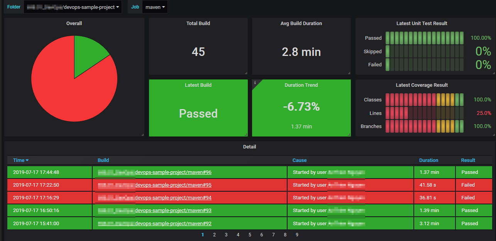

# Monitoring 
Go to “manage Jenkins” then “manage plugins” and install “ Prometheus metrics plugin”.  
This plugin will expose an endpoint (default /prometheus) with metrics where a Prometheus Server can scrape data.  
You can see the output of this plugin visiting this URL  
“http://Jenkins_HOST:PORT/prometheus”  

## change prometheus.yml
add in prometheus.yml file
```yaml
- job_name: 'jenkins'
  metrics_path: '/prometheus'
  static_configs:
    - targets: [ '<jenkins_ip>:18080' ]
```
deploy the updated file, do a reload  
`curl -s -XPOST localhost:9090/-/reload`


## Dashboard example
See the dashboard   
