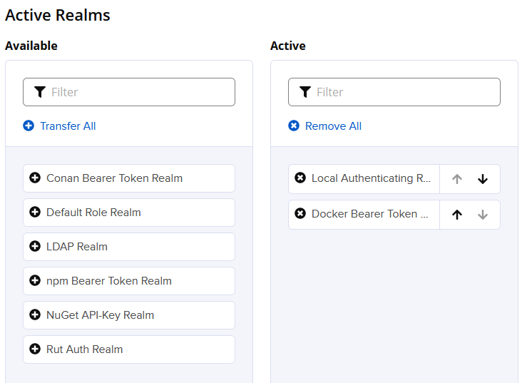

# How to use Nexus docker registry

## Configure Nexus Docker registry
Open your Nexus tab in your browser
log in in Nexus 
Go to the toothed wheel, and select **Create repository**

Choose docker registry hosted


Enter name **myregistry**
Set **HTTP port to 30999**  
allow anonymous docker pull    
Enable Docker v1 API  
Tick **Allow anonymous** docker pull
Deployment policy  to Allow redeploy
Hit Create repository
Go to Security -> Realms    
Set active  Docker Bearer Token Realm


Hit Save 

## Change docker daemon config

Add the following lines in /etc/docker/daemon.json

```json
{
  
        "insecure-registries":["nexus:30999"]
}
```

Add nexus entry in /etc/hosts as the example below 
On your local host 
Add the nexus container private address ip   
Check portainer   
```shell
127.0.0.1 localhost nexus  # add nexus after localhost
51.68.28.209 jenkins jenkins external.local
172.16.0.11 internal.local
```

## Sanity Tests
```shell
nc -vz nexus 30999 # should be succeeded
```

```shell
cd 
cd jenkins-pic 
source venv/bin/activate
docker-compose down 
 sudo systemctl restart docker
docker-compose up -d 
# wait a while
docker login -u admin -p 12345678 nexus:30999
```

## Manage Nexus docker registry in Jenkins
Create a job **petclinic-image-in-nexus**  
Copy from **petclinic-docker-run**  
In bindings, change credentials to nexuslogin  

```shell
docker login -u $USERNAME -p $PASSWORD nexus:30999
RS=`docker images --all   --filter=reference='robotshop/*:ccbb706a189c'  --format "{{.Repository}}"`
docker tag <your_dockerhub_account>/petclinic nexus:30999/petclinic
docker push nexus:30999/petclinic
```
