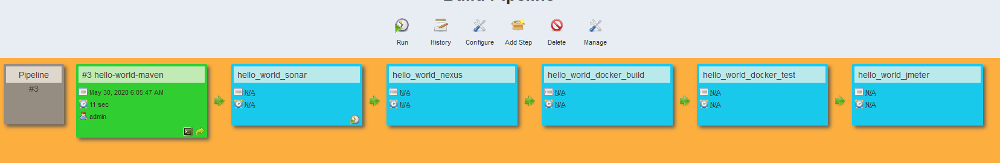

# Set up Jenkins pipeline by using the graphic interface
 Go to petclinic_maven     
 Go to Post-Build Action     
 Add Post-Build Action     
select Build other projects and type hello_world_sonar  
Press Apply and save  
Do the same action in   
petclinic_sonar  
prtclinic_nexus  
petclinic_docker_build
petclinic_docker_run, eventually for parallel run petclinic-jmeter, petclinic-selenium


## Graphic pipeline 
Go to  Manage Jenkins ->  Manage Plugin -> Tab available  
Filter Pipeline  select Build Pipeline   
Press install without restart   
Go back to the Dashboard  , click on the cross in the tab 
View name :  petclinic pipeline  
Check Build Pipeline view   
Press ok   
Verify if select initial job is set to  petclinic-maven  
See the graph   


Press run, and click on the right of the screen -> press enable auto refresh  
**Attention: Sonar**   
If you have done a docker-compose down you have to set up again the sonar token in sonar and copy this 
token in Jenkins   
**Attention: Nexus**  
Log on to Nexus  
go to administration  
select repositories 
Find Hosted  
and change the deployment policy to allow redeploy  
click save 

## Set a github webhook 
Hit a tab in your browser and go to your personnal github account.   
Select the petclinic repo   
Type on settings, it's located on the middle menu on the right side    
On the left menu select Webhooks   
click on add webhook  
Confirm with your password  
In the page, enter in Payload URL:
````shell script
  http://<jenkins_ip_address>:32500/github-webhook/
````
Select for content type :  application/json   
Press the green button Add webhook  
Refresh the screen so you can check if the url is ticked in green.  

## Configure the webhook in Jenkins  
Go to jenkins and configure petclinic-maven    
in Build Triggers , Check Github hook trigger for GITScm polling 
Press apply and save  

## Restart the Jenkins Pipeline automatically 
Go to the Jenkins pipeline graph, the refresh should be enabled  
On the other screen in Intellij IDEA   
change the file  
```hello-world/webapp/src/main/webapp/index.jsp```  
Replace the word AFIP by TEAM or vice-versa  
Commit and Push  
Check the pipeline graph, the build starts automatically


