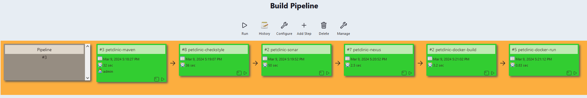

# Set up Jenkins Pipeline by using the graphic interface
 Go to hell_world_maven   
 Go to Post-Build Action   
 Add Post-Build Action   
select Build other projects and type hello_world_sonar
Press Apply and save
Do the the same action in 
hello_world_sonar
hello_world_nexus
hello_world_docker_build
hello_world_docker_test
hello_world_jmeter

## Graphic pipeline 
Go to  Manage Jenkins ->  Manage Plugin -> Tab available  
Filter Pipeline  select Build Pipeline   
Press install without restart   
Go back to the Dashboard   
View name :  hello-world pipeline  
Check Build Pipeline view   
Press ok   
Verify if select initial job is hello-world-maven  
See the graph   

Press run, and click on the right of the screen ->  enable auto refresh  
**Attention: Sonar**   
If you have done a docker-compose down you have to set up again the sonar token in sonar and copy this 
token in Jenkins   
**Attention: Nexus**
Log on to Nexus go to administration select repositories 
Find Hosted  and change the deployment policy to allow redeploy 
click save 

## Set a github webhook 

