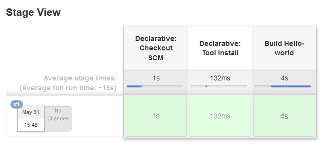

# Pipeline as DSL script Jenkins code
Go to manage Jenkins -> manage plugins -> tab available ->filter Pipeline  
Tick pipeline and press install without restart  
Go to New Item  
Type a name hello-world-pipeline   
Select Pipeline and press ok 

## First Jenkins DSL script
set build trigger  
Tick Github hook trigger ....   
Go to Pipeline  
Definition  Select  Pipeline script from SCM     
SCM git  
Enter the hello-world github repo url    
in goland copy and paste the source from the file build-hello-world-pipeline to Jenkinsfile 
Script path:  Jenkinsfile
Commit and push  
Check the job and log file
  

## Other script
Procede with the other scripts   
build-hello-world-checkstyle-pipeline copy/paste to Jenkinsfile commit/push   
build-hello-world-parallel-sonar-pipeline copy/paste to Jenkinsfile commit/push   