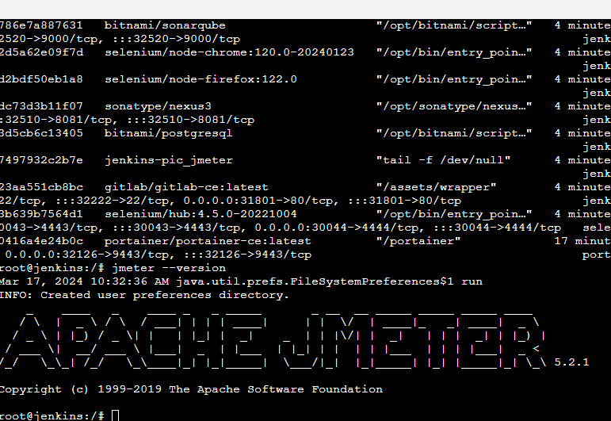

# Jenkins CI-CD SandBox

(**Beware:** for a production usage you must set up this project on a Paas such as kubernetes or Openshift). 

This Github Repo contains all relevant files for setting up an entirely CI/CD sandbox.


This sandbox is only available on Linux.

## Pre-requisite
You need a server/VM  **Ubuntu 24.04, 16GB of RAM, 4 cores, and 60 GB of SSD.**

# How to proceed ?  
## First install Docker 
Go to **UBUNTU.md** markdown file and follow the instructions.

### Install portainer for managing containers
```shell
docker volume create portainer_data
docker run -d -p 32125:8000 -p 32126:9443 --name portainer --restart=always -v /var/run/docker.sock:/var/run/docker.sock \
 -v portainer_data:/data portainer/portainer-ce:2.27.0-alpine
``` 
Quickly (there is a timeout), log on **https://<ip_address>:32126**    
Set a password and activate portainer , you should see one container


```shell
git clone  https://github.com/<your github_account>/jenkins-pic.git
cd jenkins-pic
 ```
I am using bitnami/version, for persistence the jenkins home is mapped to a docker volume  
Edit and analyse the **docker-compose.yml file** and see the usage of volumes, services and network. 

## Launch all containers
Hit the following commands for starting up all containers
```shell
docker-compose build # build all containers 
docker-compose up -d  # launch all containers
docker ps 
```

## Jenkins container sanity tests
Go to portainer    
Select the container jenkins-pic-jenkins-1  
```docker logs jenkins```
Get the initial admin password
Open a console on it     
type ```docker ps``` , you should see all containers running on your vm     
type ```jmeter --version``` , you should see jmeter prompt characters  
type ```docker-compose --version``` , you should see version v2.29.1




## Troubleshooting Sonarqube container
On the vm for fixing the sonarqube container  
Add ```sudo sysctl -w vm.max_map_count=262144```   
or  
Type this line   
```echo  vm.max_map_count=262144 | sudo tee -a /etc/sysctl.conf``` 
the variable is inserted in /etc/sysctl.conf  
and run   
```sudo sysctl -p ```  
to reload configuration with this new value
go to portainer web site and restart the container jenkins-pic-sonar-1


## In some version of bitnami jenkins 
You have to use the initial admin password
that is available in container log
```docker logs  jenkins-pic-jenkins-1 ```

## Sometimes bitnami default credential are
Log in  as **user** and password is **password** 

## If you lost your password, jenkins is secure so you must recreate the default user  
Go to jenkins  
Go to portainer and select jenkins-pic-jenkins-1  
edit /bitnami/jenkins/home/config.xml   
change the ```<useSecurity>true</useSecurity>```  
to  
```<useSecurity>false</useSecurity>```  
In portainer **Restart** the container jenkins
Open your Chrome Browser          
type the URL  http://<your_vm_ip_address>:32500        
Go to People on the left menu , and delete the current people named **user**     
Go to Dashboard->Manage Jenkins, choose Security , see the image below  


Hit save and you go right away the user screen to fill in.    
Enter **admin** as user name   
password : 12345678  
confirm: 12345678  
name : john 

## Get an API token and set timezone
click on user in right hand side on a top of a screen  
Hit configure  
select API Token , Add new token , give jetbrains name  
and Hit generate 
copy this token in your notepad for later use.  
go to Defined time zone. Select Europe/Paris  
Press  save     

## Overview
Here is an overview of all tools:
- Github is the well-known website for archiving all your projects.
- Jenkins contains build job and is triggered once projects in GitHub are updated.
- As part of the CI build, Jenkins triggers a static code analysis and the results are stored in SonarQube.
- The Maven build uses Nexus as a Proxy Repository for all 3rd party libs. The build artifacts are deployed to the Nexus Release Repository.
- Jmeter contains all requirements for running load testing and check performance regression.
- The Selenium Grid contains Docker containers running Chrome and Firefox and is used for UI tests.

## Access Tools
### With docker containers
| *Tool* | *Link*                                    | *Credentials* |
| --------- |-------------------------------------------| ------------- |
| Jenkins | http://<vm_ip default>:32500/             | to be defined |
| SonarQube | http://<vm_ip default>:32520/             | admin/admin |
| Nexus | http://<vm_ip default>:32510/nexus        | admin/use a token and set your own password |
| Selenium Grid | http://<vm_ip default>:30044/grid/console | no login required |
 | Jmeter | no required                               | no login required |
 | Portainer | **https**://<vm_ip default>:32126         | enter a password at first log in |
| Petclinic | http://<vm_ip default>:30190/petclinic    | no login required |

## See more MarkDown files with instructions

* FIRST_JOB.md 
* JETBRAINS.md
* DEPLOYMENT.md
* NEXUS_DOCKER_REGISTRY.md
* JMETER.md
* GITLAB.md
* SELENIUM.md
* PIPELINE_GUI.md
* AWX.md
* PIPELINE_SCRIPT.md

## Tips - some maintenance commands 
### clean up all   
```
docker system prune --all --volumes
docker rm -f $(docker ps -aq)
docker rmi -f $(docker images -aq)
docker volume rm $(docker volume ls -q)

=== remove docker daemon =======
sudo systemctl stop docker
sudo apt-get purge docker-ce -y
sudo apt-get autoremove --purge docker-ce -y
sudo groupdel docker
sudo rm -rf /var/lib/docker
sudo rm -rf /etc/docker

===  example of Docker dind === 
docker run -d --name test-dind --privileged -p 31999:2376 docker:dind
```