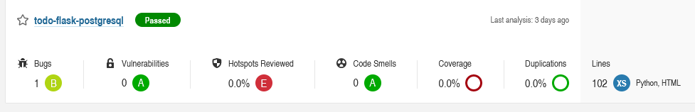

# Todo-flask-postgres

## Set sonar scanner for Python source code project
Go to Manage Jenkins -> Global Tool Configuration     
Add Select SonarQube Scanner     
Give a name    
Check install automatically , select the latest version  
Hit Save  
Create a new job    
Choose new-item, freestyle, name it **todo-flask-postgresql-sonar**   
In general, add the github repo   
In Build environment select prepare SonarQube Scanner environment  
In build step add execute shell     
```shell
pip3 install nose coverage nosexcover pylint
```
In build step add another execute shell command  
add in Analysis Properties  
```shell
sonar.projectKey=todo
sonar.projectName=todo-flask-postgresql
sonar.projectVersion=1.0
sonar.sources=
sonar.language=py
sonar.sourceEncoding=UTF-8
#test results
sonar.python.xunit.reportPath=nosetests.xml
# Coverage
sonar.python.coverage.reportPath=coverage,xml
```
## Execute the job 
Go to build now  
Check the result in SonarQube  
  

